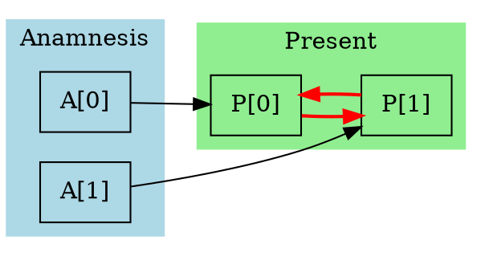

# OUROCHRONOS

## Specification Addendum: Temporal Semantics, Nondeterminism, and Diagnostic Infrastructure

### Version 1.1

---

## Abstract

This addendum extends the OUROCHRONOS specification (v1.0) with three major enhancements: (1) a formal characterisation of temporal computation, including complexity-theoretic results and canonical programming patterns; (2) revised execution semantics featuring nondeterministic fixed-point selection and unbounded iteration; and (3) a comprehensive type system with causal provenance tracking and diagnostic infrastructure for practical software development.

These extensions resolve tensions in the original specification between conceptual purity and practical usability by introducing distinct semantic modes and layered abstractions.

---

## Table of Contents

1. [Temporal Computation Theory](#1-temporal-computation-theory)
2. [Revised Execution Semantics](#2-revised-execution-semantics)
3. [Type System and Causal Tracking](#3-type-system-and-causal-tracking)
4. [Diagnostic Infrastructure](#4-diagnostic-infrastructure)
5. [Extended Instruction Set](#5-extended-instruction-set)
6. [Canonical Temporal Patterns](#6-canonical-temporal-patterns)
7. [Revised Example Programs](#7-revised-example-programs)

---

## 1. Temporal Computation Theory

### 1.1 Computational Model

We formalise OUROCHRONOS computation in terms of the Deutschian closed timelike curve (CTC) model, connecting our language to established results in quantum complexity theory.

**Definition 1.1 (CTC Computation).** A CTC computation consists of:
- A chronology-respecting register C (present memory, evolves forward)
- A CTC register T (anamnesis/prophecy channel, forms a closed loop)
- A unitary (or in our classical case, deterministic) evolution operator U

The consistency condition requires:
$$\text{Tr}_C[U(\rho_C \otimes \rho_T)U^\dagger] = \rho_T$$

In the classical deterministic case relevant to OUROCHRONOS, this reduces to our fixed-point condition.

**Theorem 1.1 (Aaronson-Watrous, 2009).** Classical polynomial-time computation with access to closed timelike curves captures exactly the complexity class PSPACE.

This theorem has profound implications for OUROCHRONOS: programs that use temporal features have computational power equivalent to PSPACE, strictly greater than NP (assuming standard complexity-theoretic conjectures).

### 1.2 The Complexity Class OURO

**Definition 1.2 (OURO).** A language L is in OURO if there exists an OUROCHRONOS program Π such that:
- For all x ∈ L: Π with input x has a consistent execution that outputs 1
- For all x ∉ L: Every consistent execution of Π with input x outputs 0
- Each epoch of Π runs in polynomial time in |x|
- The number of distinct memory cells accessed is polynomial in |x|

**Theorem 1.2.** OURO = PSPACE.

*Proof sketch.* 

(OURO ⊆ PSPACE): A PSPACE machine can simulate the fixed-point search by iterating through possible anamnesis states. Since memory is polynomial-sized and each epoch is polynomial-time, the search space is exponential but searchable in PSPACE.

(PSPACE ⊆ OURO): We reduce TQBF (True Quantified Boolean Formula) to OUROCHRONOS. Given a QBF ∀x₁∃x₂∀x₃...Qxₙ φ(x₁,...,xₙ), construct a program that:
1. Receives candidate assignments for existentially quantified variables from anamnesis
2. Verifies that for all universal variable assignments, φ evaluates to true
3. Achieves consistency iff the QBF is true

The key insight is that the fixed-point mechanism allows "guessing" existential witnesses whilst the verification phase checks universal quantification. □

### 1.3 Temporal Complexity Hierarchy

We define a hierarchy based on the structure of temporal dependencies:

**Definition 1.3 (Temporal Depth).** The temporal depth d(Π) of a program Π is the length of the longest causal chain from an anamnesis read to a present write that influences that same anamnesis cell.

**Definition 1.4 (OURO[d]).** The class OURO[d] contains languages decidable by OUROCHRONOS programs with temporal depth at most d.

**Theorem 1.3 (Temporal Hierarchy).**
- OURO[0] = P (no temporal features used)
- OURO[1] ⊇ NP ∪ coNP (single-level witness/verification)
- OURO[d] ⊆ OURO[d+1] for all d
- ⋃_{d∈ℕ} OURO[d] = OURO = PSPACE

### 1.4 Fixed-Point Multiplicity

**Definition 1.5 (Fixed-Point Spectrum).** For program Π and input I, define:

$$\text{FP}(\Pi, I) = \{A \in \text{Mem} \mid \pi_1(F_{\Pi,I}(A)) = A \land \text{status}(F_{\Pi,I}(A)) = \text{Halted}\}$$

The fixed-point spectrum characterises the set of all consistent executions.

**Definition 1.6 (Fixed-Point Properties).**
- Π is *confluent* for I if |FP(Π, I)| ≤ 1
- Π is *divergent* for I if FP(Π, I) = ∅
- Π is *ambiguous* for I if |FP(Π, I)| > 1

**Theorem 1.4.** Determining whether a program is confluent is undecidable.

**Theorem 1.5.** For ambiguous programs, different fixed points may produce different outputs. The set of possible outputs is:

$$\text{Out}(\Pi, I) = \{\pi_2(F_{\Pi,I}(A)) \mid A \in \text{FP}(\Pi, I)\}$$

### 1.5 Nondeterminism and Output Relations

Under nondeterministic semantics, OUROCHRONOS programs compute *relations* rather than functions:

**Definition 1.7 (Program Relation).** Program Π computes the relation R_Π ⊆ Input × Output where:

$$(I, O) \in R_\Pi \iff O \in \text{Out}(\Pi, I)$$

**Definition 1.8 (Deterministic Program).** Π is deterministic if R_Π is a (partial) function, i.e., for all I, |Out(Π, I)| ≤ 1.

Programming in OUROCHRONOS thus requires reasoning about which outputs are *possible* rather than which output *will occur*.

---

## 2. Revised Execution Semantics

### 2.1 Semantic Modes

OUROCHRONOS supports three semantic modes, selectable at compile-time or runtime:

| Mode | Fixed-Point Selection | Iteration Bound | Use Case |
|------|----------------------|-----------------|----------|
| **Pure** | Nondeterministic | Unbounded | Theoretical analysis, conceptual exploration |
| **Bounded** | Nondeterministic | Configurable | Practical execution with timeout |
| **Diagnostic** | Exhaustive enumeration | Configurable | Development, debugging, verification |

### 2.2 Pure Mode Semantics

In Pure mode, the interpreter embodies the philosophical stance that the universe *finds* a self-consistent timeline without prejudice toward any particular resolution.

**Definition 2.1 (Pure Execution).** Pure execution of program Π with input I is the relation:

$$\text{exec}_{\text{pure}}(\Pi, I) = \text{Out}(\Pi, I)$$

The interpreter returns *some* element of this set if non-empty; behaviour is undefined (non-termination) if the set is empty or if no fixed point is reachable from the initial state.

**Algorithm 2.1 (Pure Mode Interpreter).**

```
function execute_pure(Π, I) -> Option<Output>:
    A := initial_anamnesis()          // Implementation-defined starting point
    
    loop:                              // Unbounded iteration
        (P, O, σ) := epoch(Π, A, I)
        
        match σ:
            Paradox → 
                A := perturb(A)        // Try different starting point
                continue
            Halted →
                if P = A:
                    return Some(O)     // Fixed point found
                else:
                    A := P             // Continue iteration
            Error(e) →
                A := perturb(A)        // Try different starting point
                continue
```

The `perturb` function introduces controlled variation to escape limit cycles:

```
function perturb(A: Memory) -> Memory:
    // Select a random cell and modify its value
    addr := random_address()
    delta := random_value()
    return A[addr ↦ (A[addr] + delta) mod W]
```

**Remark.** Pure mode may not terminate. This is intentional: an inconsistent program represents an impossible physical situation, and the interpreter's non-termination reflects the universe's inability to find a consistent history.

### 2.3 Bounded Mode Semantics

Bounded mode adds practical termination guarantees whilst preserving nondeterminism.

**Definition 2.2 (Bounded Execution Parameters).**
- `max_epochs`: Maximum number of epoch executions (default: 100,000)
- `max_epoch_steps`: Maximum steps within a single epoch (default: 10,000,000)
- `max_perturbations`: Maximum escape attempts from limit cycles (default: 1,000)

**Algorithm 2.2 (Bounded Mode Interpreter).**

```
function execute_bounded(Π, I, params) -> ExecutionResult:
    A := initial_anamnesis()
    epochs := 0
    perturbations := 0
    trajectory := []                   // For diagnostic extraction
    
    while epochs < params.max_epochs:
        (P, O, σ) := epoch_bounded(Π, A, I, params.max_epoch_steps)
        trajectory.append((A, P, O, σ))
        epochs += 1
        
        match σ:
            Paradox →
                if perturbations < params.max_perturbations:
                    A := perturb(A)
                    perturbations += 1
                else:
                    return ExecutionResult.Exhausted(trajectory)
            
            Halted →
                if P = A:
                    return ExecutionResult.Consistent(O, trajectory)
                else if detected_cycle(trajectory):
                    if perturbations < params.max_perturbations:
                        A := perturb(A)
                        perturbations += 1
                    else:
                        return ExecutionResult.Cyclic(extract_cycle(trajectory))
                else:
                    A := P
            
            Timeout →
                return ExecutionResult.EpochTimeout(epochs, trajectory)
            
            Error(e) →
                return ExecutionResult.Error(e, trajectory)
    
    return ExecutionResult.EpochLimitReached(trajectory)
```

**Definition 2.3 (Cycle Detection).** A cycle is detected when the trajectory contains repeated memory states:

```
function detected_cycle(trajectory) -> bool:
    seen := HashSet()
    for (A, P, O, σ) in trajectory:
        h := hash(P)
        if h in seen:
            return true
        seen.add(h)
    return false
```

### 2.4 Diagnostic Mode Semantics

Diagnostic mode exhaustively explores the fixed-point spectrum, providing complete information about program behaviour.

**Algorithm 2.3 (Diagnostic Mode Interpreter).**

```
function execute_diagnostic(Π, I, params) -> DiagnosticResult:
    // Phase 1: Discover fixed points via diverse starting points
    fixed_points := Set()
    trajectories := Map()              // Starting point → trajectory
    
    for seed in generate_seeds(params.seed_count):
        A := seed
        trajectory := []
        
        for epoch_num in 0..params.max_epochs_per_seed:
            (P, O, σ) := epoch_bounded(Π, A, I, params.max_epoch_steps)
            trajectory.append(EpochRecord(A, P, O, σ, causal_graph(Π, A)))
            
            match σ:
                Halted if P = A →
                    fixed_points.add(FixedPoint(A, O))
                    break
                Halted →
                    A := P
                _ →
                    break
        
        trajectories[seed] := trajectory
    
    // Phase 2: Analyse fixed-point structure
    analysis := FixedPointAnalysis(
        fixed_points = fixed_points,
        outputs = {fp.output for fp in fixed_points},
        is_confluent = |fixed_points| <= 1,
        is_deterministic = |{fp.output for fp in fixed_points}| <= 1,
    )
    
    // Phase 3: Characterise non-convergent behaviour
    limit_cycles := detect_all_cycles(trajectories)
    divergent_cells := identify_unstable_cells(trajectories)
    
    return DiagnosticResult(
        analysis = analysis,
        trajectories = trajectories,
        limit_cycles = limit_cycles,
        divergent_cells = divergent_cells,
        causal_summary = aggregate_causal_graphs(trajectories),
    )
```

### 2.5 Initial Anamnesis Selection

The choice of initial anamnesis affects which fixed points are reachable. We define several strategies:

**Definition 2.4 (Initialisation Strategies).**

| Strategy | Description | Use Case |
|----------|-------------|----------|
| `Zero` | All cells initialised to 0 | Default, deterministic starting point |
| `Random` | Uniform random values | Exploration, escaping local structure |
| `Seeded(s)` | Deterministic from seed s | Reproducible nondeterminism |
| `Guided(hints)` | User-provided partial assignment | When programmer has domain knowledge |
| `Adversarial` | Chosen to maximise iteration count | Testing, worst-case analysis |

**Definition 2.5 (Seed Generation for Diagnostic Mode).**

```
function generate_seeds(count: int) -> Iterator<Memory>:
    yield zero_memory()                          // Always include zero
    
    // Single-cell variations
    for addr in sample_addresses(count / 4):
        for value in [1, W/2, W-1]:
            yield zero_memory()[addr ↦ value]
    
    // Random memories
    for _ in 0..(count / 2):
        yield random_memory()
    
    // Structured patterns
    yield alternating_memory()                   // 0, 1, 0, 1, ...
    yield ascending_memory()                     // 0, 1, 2, 3, ...
```

---

## 3. Type System and Causal Tracking

### 3.1 Overview

The OUROCHRONOS type system serves two purposes: (1) enabling static verification of program properties, and (2) supporting runtime causal tracking for diagnostics. The type system is optional; untyped programs are implicitly assigned the universal type.

### 3.2 Base Types

**Definition 3.1 (Type Grammar).**

```
Type τ ::= Unit                        -- Singleton type
         | Val                         -- Untracked 64-bit value
         | Temporal(ρ)                 -- Value with provenance ρ
         | τ₁ × τ₂                     -- Product type
         | τ₁ + τ₂                     -- Sum type
         | List(τ)                     -- Homogeneous list
         | τ₁ → τ₂                     -- Function type (for macros)
         | ∀α. τ                       -- Universal quantification
         | ∃α. τ                       -- Existential quantification

Provenance ρ ::= ⊥                     -- No temporal dependency
               | Oracle(A)             -- Depends on anamnesis cells A
               | Computed(ρ₁, ..., ρₙ) -- Derived from other provenances
               | ρ₁ ⊔ ρ₂              -- Join (union of dependencies)
               | α                     -- Provenance variable
```

### 3.3 Provenance Lattice

Provenances form a lattice under the dependency ordering:

**Definition 3.2 (Provenance Ordering).** ρ₁ ⊑ ρ₂ iff every anamnesis cell that ρ₁ depends on is also a dependency of ρ₂.

```
                    ⊤ (depends on everything)
                   /|\
                  / | \
                 /  |  \
    Oracle({0,1})  ...  Oracle({n-1,n})
                \   |   /
                 \  |  /
                  \ | /
        Oracle({0}) ... Oracle({n})
                  \ | /
                   \|/
                    ⊥ (no temporal dependency)
```

**Definition 3.3 (Provenance Operations).**

```
⊥ ⊔ ρ = ρ
ρ ⊔ ⊥ = ρ
Oracle(A₁) ⊔ Oracle(A₂) = Oracle(A₁ ∪ A₂)
Computed(ρ₁, ..., ρₙ) = ρ₁ ⊔ ... ⊔ ρₙ
```

### 3.4 Typing Rules

**Judgement Form:** Γ ⊢ e : τ | ρ

Read as: "Under context Γ, expression e has type τ with provenance ρ."

**Literals and Constants:**
```
─────────────────────────
Γ ⊢ n : Val | ⊥

Γ(x) = τ | ρ
─────────────────────────
Γ ⊢ x : τ | ρ
```

**Temporal Operations:**
```
Γ ⊢ e : Val | ρ
─────────────────────────────────────────────
Γ ⊢ ORACLE[e] : Temporal(Oracle(eval(e))) | Oracle(eval(e)) ⊔ ρ

Γ ⊢ e : Val | ρ
─────────────────────────────────
Γ ⊢ PRESENT[e] : Val | ρ
```

Note: ORACLE reads introduce temporal dependency; PRESENT reads do not (they read the *current* epoch's memory, not future information).

**Arithmetic:**
```
Γ ⊢ e₁ : Val | ρ₁    Γ ⊢ e₂ : Val | ρ₂
──────────────────────────────────────────
Γ ⊢ e₁ + e₂ : Val | ρ₁ ⊔ ρ₂
```

**Temporal Coercion:**
```
Γ ⊢ e : Temporal(ρ) | ρ'
─────────────────────────────
Γ ⊢ e : Val | ρ ⊔ ρ'
```

Temporal types can be coerced to Val, preserving provenance in the judgement.

**Memory Writes:**
```
Γ ⊢ e₁ : Val | ρ₁    Γ ⊢ e₂ : τ | ρ₂
────────────────────────────────────────────────────────
Γ ⊢ PRESENT[e₁] <- e₂ : Unit | ρ₁ ⊔ ρ₂
    with effect: writes(eval(e₁), ρ₂)
```

The `writes` effect records that the cell at address `eval(e₁)` now carries provenance ρ₂.

### 3.5 Causal Graphs

**Definition 3.4 (Causal Graph).** A causal graph G = (V, E) where:
- V = Addr (vertices are memory addresses)
- E ⊆ Addr × Addr (edge (a₁, a₂) means a₂'s value causally depends on a₁)

**Definition 3.5 (Epoch Causal Graph).** For an epoch execution, the causal graph is constructed:

```
function build_causal_graph(execution_trace) -> CausalGraph:
    G := empty_graph()
    current_provenance := Map<Addr, Set<Addr>>()  // Cell → its anamnesis dependencies
    
    for instruction in execution_trace:
        match instruction:
            OracleRead(addr) →
                // Reading from anamnesis creates a source node
                G.add_node(addr, source=true)
                push_provenance({addr})
            
            PresentRead(addr) →
                // Reading from present inherits that cell's provenance
                push_provenance(current_provenance.get(addr, {}))
            
            PresentWrite(addr, value_provenance) →
                // Writing records the causal chain
                current_provenance[addr] := value_provenance
                for source_addr in value_provenance:
                    G.add_edge(source_addr, addr)
            
            BinaryOp(op) →
                // Operations merge provenances
                ρ₂ := pop_provenance()
                ρ₁ := pop_provenance()
                push_provenance(ρ₁ ∪ ρ₂)
    
    return G
```

### 3.6 Consistency Analysis via Types

**Definition 3.6 (Temporal Consistency Requirement).** For a program to be consistent, every cell written to present must either:
1. Have provenance ⊥ (no temporal dependency), or
2. Have provenance Oracle(A) where A contains only cells that are also written with matching values

**Theorem 3.1 (Type-Based Consistency).** If a program is well-typed and all present writes have provenance ⊥, the program is trivially consistent.

*Proof.* If no writes depend on anamnesis, then F(A) = F(A') for all A, A'. Thus any initial anamnesis yields the same present, which is therefore a fixed point. □

**Definition 3.7 (Temporal Purity).** A program region is temporally pure if all expressions within it have provenance ⊥.

Temporally pure regions can be optimised aggressively, as they behave identically across all epochs.

### 3.7 Gradual Typing

OUROCHRONOS supports gradual typing for incremental adoption:

**Definition 3.8 (Dynamic Type).** The type `Dyn` represents dynamically-typed values:

```
τ ::= ... | Dyn
```

**Coercion Rules:**
```
Γ ⊢ e : τ | ρ
─────────────────────
Γ ⊢ e : Dyn | ρ

Γ ⊢ e : Dyn | ρ
─────────────────────────────
Γ ⊢ e as τ : τ | ρ   (runtime check)
```

Untyped programs are implicitly typed with Dyn everywhere.

---

## 4. Diagnostic Infrastructure

### 4.1 Trajectory Recording

**Definition 4.1 (Epoch Record).** An epoch record captures complete information about a single epoch:

```
struct EpochRecord {
    epoch_number: u64,
    initial_anamnesis: Memory,
    final_present: Memory,
    output: Vec<Value>,
    status: Status,
    causal_graph: CausalGraph,
    instruction_trace: Vec<InstructionRecord>,
    duration_ns: u64,
}

struct InstructionRecord {
    pc: usize,
    opcode: Opcode,
    stack_before: Vec<Value>,
    stack_after: Vec<Value>,
    memory_reads: Vec<(Addr, Value, MemoryType)>,
    memory_writes: Vec<(Addr, Value)>,
    provenance_stack: Vec<Provenance>,
}
```

### 4.2 Convergence Diagnostics

**Definition 4.2 (Convergence Report).** After execution, the interpreter produces:

```
struct ConvergenceReport {
    outcome: Outcome,
    epochs_executed: u64,
    fixed_points_found: Vec<FixedPoint>,
    limit_cycles: Vec<LimitCycle>,
    cell_stability: Map<Addr, CellStability>,
    causal_summary: CausalSummary,
}

enum Outcome {
    Consistent { output: Vec<Value>, fixed_point: Memory },
    MultipleConsistent { outputs: Set<Vec<Value>>, fixed_points: Set<Memory> },
    Cyclic { cycle: LimitCycle },
    Divergent { pattern: DivergencePattern },
    Timeout { partial_trajectory: Vec<EpochRecord> },
    Paradox { reason: String },
}

enum CellStability {
    Stable { value: Value, since_epoch: u64 },
    Oscillating { period: u64, values: Vec<Value> },
    Diverging { pattern: DivergencePattern },
    Unused,
}

enum DivergencePattern {
    Monotonic { direction: Direction },
    Chaotic,
    Unknown,
}
```

### 4.3 Causal Analysis

**Definition 4.3 (Causal Summary).** Aggregated causal information across epochs:

```
struct CausalSummary {
    // Which anamnesis cells influence which present cells?
    influence_matrix: Map<Addr, Set<Addr>>,
    
    // Which cells form feedback loops?
    feedback_loops: Vec<Vec<Addr>>,
    
    // Which cells are "temporally pure" (no anamnesis dependency)?
    pure_cells: Set<Addr>,
    
    // Critical path: longest causal chain affecting consistency
    critical_path: Vec<Addr>,
    
    // Cells involved in detected inconsistencies
    inconsistent_cells: Set<Addr>,
}
```

**Algorithm 4.1 (Feedback Loop Detection).**

```
function detect_feedback_loops(causal_graph: CausalGraph) -> Vec<Vec<Addr>>:
    // Find strongly connected components in the causal graph
    sccs := tarjan_scc(causal_graph)
    
    // Filter to SCCs with cycles (size > 1 or self-loop)
    loops := []
    for scc in sccs:
        if |scc| > 1 or has_self_edge(causal_graph, scc[0]):
            loops.append(scc)
    
    return loops
```

### 4.4 Interactive Debugging

**Definition 4.4 (Debug Commands).** The diagnostic interpreter supports:

| Command | Description |
|---------|-------------|
| `step` | Execute one instruction |
| `epoch` | Execute one complete epoch |
| `run` | Execute until fixed point or limit |
| `break <addr>` | Break on memory access to addr |
| `watch <addr>` | Report all accesses to addr |
| `trace <cell>` | Show causal history of cell |
| `compare <e1> <e2>` | Compare two epochs |
| `graph` | Visualise current causal graph |
| `stable` | List cells that have stabilised |
| `unstable` | List cells still changing |
| `predict` | Estimate epochs to convergence |
| `perturb <addr> <val>` | Manually modify anamnesis |
| `snapshot` | Save current state |
| `restore <id>` | Restore saved state |

### 4.5 Visualisation Outputs

The diagnostic infrastructure produces several visualisation formats:

**Causal Graph (DOT format):**


**Convergence Timeline (ASCII):**
```
Epoch │ Cell 0    │ Cell 1    │ Cell 2    │ Status
──────┼───────────┼───────────┼───────────┼─────────
    0 │ 0 → 42    │ 0 → 17    │ 0 → 0     │ ✗
    1 │ 42 → 42   │ 17 → 23   │ 0 → 5     │ ✗
    2 │ 42 → 42   │ 23 → 23   │ 5 → 5     │ ✓ CONSISTENT
      │ [STABLE]  │ [STABLE]  │ [STABLE]  │
```

**Stability Heatmap:**
```
Memory addresses 0-255, coloured by stability:
  ██ = Stable (unchanged for 10+ epochs)
  ▓▓ = Stabilising (unchanged for 3-9 epochs)  
  ░░ = Unstable (changed in last 2 epochs)
  ·· = Unused (never written)

00: ██ ██ ██ ░░ ░░ ██ ██ ██ ·· ·· ·· ·· ·· ·· ·· ··
10: ██ ██ ██ ██ ▓▓ ▓▓ ██ ██ ·· ·· ·· ·· ·· ·· ·· ··
...
```

---

## 5. Extended Instruction Set

### 5.1 Diagnostic Instructions

We extend the instruction set with diagnostic primitives:

| Opcode | Mnemonic | Description |
|--------|----------|-------------|
| 0x70 | `TRACE_ON` | Enable instruction tracing |
| 0x71 | `TRACE_OFF` | Disable instruction tracing |
| 0x72 | `ASSERT_STABLE` addr | Assert cell has stabilised |
| 0x73 | `ASSERT_CONSISTENT` | Assert current state is fixed point |
| 0x74 | `DUMP_CAUSAL` addr | Emit causal history of cell |
| 0x75 | `EPOCH_NUM` | Push current epoch number |
| 0x76 | `PROVENANCE` addr | Push provenance bitset for cell |
| 0x77 | `CHECKPOINT` id | Create named checkpoint |
| 0x78 | `COMMENT` len bytes | Embedded comment (ignored) |

### 5.2 Temporal Annotations

Source-level annotations for the type system:

```ouro
;; Declare a temporally pure region
@pure {
    ;; All code here must have provenance ⊥
    PUSH 1;
    PUSH 2;
    ADD;
}

;; Annotate expected provenance
@expects_oracle(0, 1, 2)  ;; This value should depend on A[0], A[1], A[2]
ORACLE[0];
ORACLE[1];
ADD;
ORACLE[2];
ADD;

;; Declare a cell as a "prophecy target"
@prophecy(result_addr)
MANIFEST result_addr = 100;

;; Assert consistency requirement
@must_stabilise(result_addr, max_epochs=10)
```

### 5.3 Structured Temporal Patterns

High-level constructs that compile to idiomatic temporal code:

```ouro
;; PROPHESY-VERIFY block: receive from future, verify, fulfil
PROPHESY result INTO result_addr {
    ;; 'result' is bound to ORACLE[result_addr]
    ;; This block must write to PRESENT[result_addr]
    ;; Consistency requires: verification succeeds ⟺ result is correct
    
    computed := /* compute expected value */;
    VERIFY result = computed;  ;; Implicit: write computed to result_addr
}

;; TEMPORAL-SEARCH: find value satisfying predicate
SEARCH x IN 0..1000 SATISFYING {
    is_prime(x) AND x > 500
} INTO result_addr;

;; WITNESS pattern: receive and verify witness for NP problem
WITNESS w FOR problem_instance {
    VERIFY is_valid_witness(problem_instance, w);
} INTO witness_addr;
```

---

## 6. Canonical Temporal Patterns

### 6.1 The Witness Pattern (NP Problems)

**Structure:** Receive a candidate solution from the future, verify it, propagate if valid.

**Template:**
```ouro
;; Solve NP problem: does instance I have a valid witness?

MANIFEST WITNESS_ADDR = 0;
MANIFEST RESULT_ADDR = 1;

;; Receive claimed witness from oracle
PUSH WITNESS_ADDR;
ORACLE[PEEK];
DROP;
;; Stack: [witness]

;; Verify witness
;; ... verification code ...
;; Stack: [witness, is_valid]

IF PEEK THEN
    ;; Valid witness: propagate it (creates fixed point)
    DROP;
    PUSH WITNESS_ADDR;
    SWAP;
    PRESENT[PEEK] <- PEEK;
    DROP; DROP;
    
    PUSH 1;
    PUSH RESULT_ADDR;
    SWAP;
    PRESENT[PEEK] <- PEEK;
    DROP; DROP;
ELSE
    ;; Invalid witness: try next value
    DROP;
    PUSH 1;
    ADD;  ;; Increment witness
    PUSH WITNESS_ADDR;
    SWAP;
    PRESENT[PEEK] <- PEEK;
    DROP; DROP;
    
    PUSH 0;
    PUSH RESULT_ADDR;
    SWAP;
    PRESENT[PEEK] <- PEEK;
    DROP; DROP;
END

HALT;
```

**Fixed-Point Semantics:**
- If a valid witness w exists: A[WITNESS_ADDR] = w is a fixed point
- If no valid witness exists: iteration increments forever (divergent) or wraps around (cyclic without fixed point)

**Complexity:** Solves NP problems in expected polynomial epochs.

### 6.2 The Bootstrap Pattern (Self-Referential Computation)

**Structure:** Receive the final result, verify by recomputation, propagate.

**Template:**
```ouro
;; Compute f(x) by receiving f(x) from the future and verifying

MANIFEST INPUT_ADDR = 0;
MANIFEST RESULT_ADDR = 1;

;; Read input
PUSH INPUT_ADDR;
PRESENT[PEEK];
DROP;
;; Stack: [x]

;; Receive claimed result from oracle
PUSH RESULT_ADDR;
ORACLE[PEEK];
DROP;
;; Stack: [x, claimed_f_x]

;; Compute f(x) independently
SWAP;
;; ... computation of f(x) ...
;; Stack: [claimed_f_x, computed_f_x]

;; Verify and propagate
DUP;
ROT;
EQ;
IF THEN
    ;; Match: propagate (fixed point)
    PUSH RESULT_ADDR;
    SWAP;
    PRESENT[PEEK] <- PEEK;
    DROP; DROP;
ELSE
    ;; Mismatch: write computed value (will iterate)
    PUSH RESULT_ADDR;
    SWAP;
    PRESENT[PEEK] <- PEEK;
    DROP; DROP;
END

HALT;
```

**Fixed-Point Semantics:** 
- Converges when A[RESULT_ADDR] = f(x)
- Typically converges in 2 epochs: epoch 1 computes f(x), epoch 2 verifies

### 6.3 The Oracle Table Pattern (Precomputed Lookup)

**Structure:** Use anamnesis as a lookup table that must be self-consistently populated.

**Template:**
```ouro
;; Compute f(0), f(1), ..., f(n-1) using table lookup with self-consistency

MANIFEST N = 100;
MANIFEST TABLE_BASE = 0;

;; For each index i, the oracle provides f(i)
;; We verify and propagate each entry

PUSH 0;  ;; i = 0

table_loop:
    DUP;
    PUSH N;
    LT;
    NOT;
    IF THEN
        DROP;
        GOTO done;
    END
    
    ;; Read oracle's claimed f(i)
    DUP;
    PUSH TABLE_BASE;
    ADD;
    ORACLE[PEEK];
    DROP;
    ;; Stack: [i, claimed_f_i]
    
    ;; Compute f(i) (may reference other table entries via oracle)
    OVER;
    ;; ... compute f(i), possibly using ORACLE[TABLE_BASE + j] for j < i ...
    ;; Stack: [i, claimed_f_i, computed_f_i]
    
    ;; Write computed value to present (will match oracle at fixed point)
    DUP;
    ROT;
    ROT;
    ;; Stack: [i, computed_f_i, claimed_f_i, computed_f_i]
    PUSH TABLE_BASE;
    ROT;
    ADD;
    ;; Stack: [i, computed_f_i, claimed_f_i, TABLE_BASE + i]
    SWAP;
    DROP;  ;; Discard claimed, keep computed
    ;; Stack: [i, computed_f_i, TABLE_BASE + i]
    SWAP;
    PRESENT[PEEK] <- PEEK;
    DROP; DROP;
    
    ;; Increment i
    ;; Stack: [i]
    PUSH 1;
    ADD;
    GOTO table_loop;

done:
    HALT;
```

**Fixed-Point Semantics:**
- At fixed point, ORACLE[TABLE_BASE + i] = f(i) for all i
- Enables dynamic programming with "free" memoisation from the future

### 6.4 The Constraint Satisfaction Pattern (PSPACE Problems)

**Structure:** Encode constraints as consistency requirements; solution exists iff fixed point exists.

**Template for QBF ∀x∃y.φ(x,y):**
```ouro
;; Solve: ∀x ∈ {0,1}. ∃y ∈ {0,1}. φ(x, y)

MANIFEST Y_FOR_X0_ADDR = 0;  ;; Oracle provides y when x=0
MANIFEST Y_FOR_X1_ADDR = 1;  ;; Oracle provides y when x=1
MANIFEST RESULT_ADDR = 2;

;; Receive claimed witnesses for each universal case
PUSH Y_FOR_X0_ADDR;
ORACLE[PEEK];
DROP;
;; Stack: [y₀]

PUSH Y_FOR_X1_ADDR;
ORACLE[PEEK];
DROP;
;; Stack: [y₀, y₁]

;; Verify φ(0, y₀)
OVER;
PUSH 0;
SWAP;
;; ... evaluate φ(0, y₀) ...
;; Stack: [y₀, y₁, φ(0,y₀)]

;; Verify φ(1, y₁)
ROT;
PUSH 1;
SWAP;
;; ... evaluate φ(1, y₁) ...
;; Stack: [y₁, φ(0,y₀), φ(1,y₁)]

;; Both must be true
AND;
;; Stack: [y₁, all_satisfied]

IF PEEK THEN
    ;; All constraints satisfied: propagate witnesses
    DROP;
    PUSH Y_FOR_X1_ADDR;
    SWAP;
    PRESENT[PEEK] <- PEEK;
    DROP; DROP;
    
    ;; y₀ already on stack... (simplified; full version tracks both)
    ;; ... propagate y₀ to Y_FOR_X0_ADDR ...
    
    PUSH 1;  ;; QBF is true
ELSE
    ;; Constraints not satisfied: increment witnesses
    ;; ... increment y₀ and/or y₁ ...
    ;; ... write to present ...
    
    PUSH 0;  ;; QBF is (probably) false
END

PUSH RESULT_ADDR;
SWAP;
PRESENT[PEEK] <- PEEK;
DROP; DROP;

HALT;
```

**Fixed-Point Semantics:**
- Fixed point exists ⟺ QBF is true
- Witnesses y₀, y₁ at fixed point satisfy the existential requirements

### 6.5 The Paradox-Avoidance Pattern (Robust Programs)

**Structure:** Detect and escape potential paradoxes by choosing consistent branches.

**Template:**
```ouro
;; Compute result, but avoid grandfather paradox by choosing consistent path

MANIFEST CHOICE_ADDR = 0;
MANIFEST RESULT_ADDR = 1;

;; Receive hint about which branch to take
PUSH CHOICE_ADDR;
ORACLE[PEEK];
DROP;
;; Stack: [choice]

DUP;
PUSH 0;
EQ;
IF THEN
    ;; Branch A: some computation
    DROP;
    ;; ... compute result_a ...
    PUSH result_a;
    
    ;; Verify this branch is self-consistent
    ;; (write same choice we received)
    PUSH 0;
    PUSH CHOICE_ADDR;
    SWAP;
    PRESENT[PEEK] <- PEEK;
    DROP; DROP;
ELSE
    ;; Branch B: different computation
    DROP;
    ;; ... compute result_b ...
    PUSH result_b;
    
    PUSH 1;
    PUSH CHOICE_ADDR;
    SWAP;
    PRESENT[PEEK] <- PEEK;
    DROP; DROP;
END

;; Write result (different per branch, but each is self-consistent)
PUSH RESULT_ADDR;
SWAP;
PRESENT[PEEK] <- PEEK;
DROP; DROP;

HALT;
```

**Fixed-Point Semantics:**
- Multiple fixed points may exist (one per valid branch)
- Nondeterministic selection chooses one
- Program is never paradoxical (each branch is internally consistent)

---

## 7. Revised Example Programs

### 7.1 SAT Solver

```ouro
;; SAT Solver: determine satisfiability of CNF formula
;; Formula: (x₁ ∨ x₂) ∧ (¬x₁ ∨ x₃) ∧ (¬x₂ ∨ ¬x₃)
;; Variables: x₁, x₂, x₃ ∈ {0, 1}

MANIFEST X1_ADDR = 0;
MANIFEST X2_ADDR = 1;
MANIFEST X3_ADDR = 2;
MANIFEST SAT_ADDR = 3;

;; Receive variable assignments from oracle
PUSH X1_ADDR; ORACLE[PEEK]; DROP;  ;; Stack: [x₁]
PUSH X2_ADDR; ORACLE[PEEK]; DROP;  ;; Stack: [x₁, x₂]
PUSH X3_ADDR; ORACLE[PEEK]; DROP;  ;; Stack: [x₁, x₂, x₃]

;; Evaluate clause 1: (x₁ ∨ x₂)
ROT; ROT;      ;; Stack: [x₃, x₁, x₂]
OVER;          ;; Stack: [x₃, x₁, x₂, x₁]
ROT;           ;; Stack: [x₃, x₂, x₁, x₁]  -- wait, let me redo this

;; Let's use memory to store and retrieve cleanly
;; Store variables in present temporarily for evaluation
PUSH X3_ADDR; SWAP; PRESENT[PEEK] <- PEEK; DROP; DROP;
PUSH X2_ADDR; SWAP; PRESENT[PEEK] <- PEEK; DROP; DROP;
PUSH X1_ADDR; SWAP; PRESENT[PEEK] <- PEEK; DROP; DROP;

;; Clause 1: (x₁ ∨ x₂)
PUSH X1_ADDR; PRESENT[PEEK]; DROP;
PUSH X2_ADDR; PRESENT[PEEK]; DROP;
OR;
;; Stack: [c₁]

;; Clause 2: (¬x₁ ∨ x₃)
PUSH X1_ADDR; PRESENT[PEEK]; DROP;
NOT;
PUSH X3_ADDR; PRESENT[PEEK]; DROP;
OR;
;; Stack: [c₁, c₂]

;; Clause 3: (¬x₂ ∨ ¬x₃)
PUSH X2_ADDR; PRESENT[PEEK]; DROP;
NOT;
PUSH X3_ADDR; PRESENT[PEEK]; DROP;
NOT;
OR;
;; Stack: [c₁, c₂, c₃]

;; Conjunction of all clauses
AND;
AND;
;; Stack: [satisfiable]

;; If satisfiable, we have a consistent assignment
;; Variables already written to present match oracle at fixed point
DUP;
PUSH SAT_ADDR;
SWAP;
PRESENT[PEEK] <- PEEK;
DROP; DROP;

;; Output result
PUSH SAT_ADDR;
PRESENT[PEEK];
DROP;
OUTPUT;

HALT;
```

**Execution Analysis:**
- If formula is satisfiable: Oracle provides satisfying assignment, verification succeeds, fixed point achieved with SAT_ADDR = 1
- If unsatisfiable: No oracle assignment passes verification, iteration explores all 2³ assignments without finding fixed point, result is NonConvergent (in bounded mode) or divergent (in pure mode)

**Diagnostic Output (satisfiable case):**
```
Convergence Report:
  Outcome: Consistent
  Epochs: 1
  Fixed Point:
    A[0] = P[0] = 1  (x₁ = true)
    A[1] = P[1] = 0  (x₂ = false)
    A[2] = P[2] = 1  (x₃ = true)
    A[3] = P[3] = 1  (satisfiable)
  Output: [1]
  
Causal Graph:
  Oracle[0] ──┬──→ Present[0]
              ├──→ Present[3]
  Oracle[1] ──┼──→ Present[1]
              ├──→ Present[3]
  Oracle[2] ──┴──→ Present[2]
              └──→ Present[3]
```

### 7.2 Discrete Logarithm (with Witness)

```ouro
;; Discrete Logarithm: find x such that g^x ≡ h (mod p)
;; This is a hard problem classically, but with temporal witness, we can verify.
;; (In practice, the oracle must "guess" the correct x for consistency.)

MANIFEST G_ADDR = 0;      ;; Generator g
MANIFEST H_ADDR = 1;      ;; Target h
MANIFEST P_ADDR = 2;      ;; Prime modulus p
MANIFEST X_ADDR = 3;      ;; Solution x (from oracle)
MANIFEST RESULT_ADDR = 4;

;; Read problem parameters (assumed pre-loaded in present)
PUSH G_ADDR; PRESENT[PEEK]; DROP;  ;; g
PUSH H_ADDR; PRESENT[PEEK]; DROP;  ;; h
PUSH P_ADDR; PRESENT[PEEK]; DROP;  ;; p

;; Receive claimed solution from oracle
PUSH X_ADDR; ORACLE[PEEK]; DROP;   ;; x

;; Compute g^x mod p using repeated squaring
;; Stack: [g, h, p, x]
;; ... (modular exponentiation implementation) ...
;; Result: [g, h, p, x, g^x mod p]

;; For brevity, assume helper function:
;; CALL mod_exp;  ;; Computes g^x mod p, pushes result
;; Stack: [g, h, p, x, computed]

;; Verify: computed == h?
;; Stack manipulation to compare with h
ROT; ROT; ROT;    ;; [g, x, computed, h, p]
DROP;             ;; [g, x, computed, h]
EQ;               ;; [g, x, is_correct]

IF PEEK THEN
    ;; Correct! Propagate x to present
    DROP; DROP;
    PUSH X_ADDR;
    SWAP;
    PRESENT[PEEK] <- PEEK;
    DROP; DROP;
    
    PUSH 1;
ELSE
    ;; Incorrect, try next x
    DROP;
    PUSH 1;
    ADD;
    PUSH X_ADDR;
    SWAP;
    PRESENT[PEEK] <- PEEK;
    DROP; DROP;
    
    PUSH 0;
END

PUSH RESULT_ADDR;
SWAP;
PRESENT[PEEK] <- PEEK;
DROP; DROP;

PUSH RESULT_ADDR;
PRESENT[PEEK];
DROP;
OUTPUT;

PUSH X_ADDR;
PRESENT[PEEK];
DROP;
OUTPUT;

HALT;
```

**Complexity Note:** Discrete logarithm is believed to be hard (no known polynomial-time algorithm). OUROCHRONOS doesn't magically solve it efficiently—the fixed-point search must still find the correct x, which takes exponential epochs in the worst case. However, once found, verification is instant. This illustrates that OURO = PSPACE, not NP: we can solve problems where verification itself might require significant computation.

### 7.3 Quine (Self-Reproducing via Temporal Bootstrap)

```ouro
;; Temporal Quine: A program that outputs its own source
;; using the bootstrap pattern.
;;
;; The program receives its source from the future,
;; verifies it by execution comparison, and outputs it.

MANIFEST SOURCE_START = 0;
MANIFEST SOURCE_LEN = 100;
MANIFEST HASH_ADDR = 200;

;; Receive claimed source from oracle
PUSH 0;  ;; index i

receive_loop:
    DUP;
    PUSH SOURCE_LEN;
    LT;
    NOT;
    IF THEN
        DROP;
        GOTO verify;
    END
    
    DUP;
    PUSH SOURCE_START;
    ADD;
    ORACLE[PEEK];
    DROP;
    ;; Stack: [i, source[i]]
    
    ;; Write to present (will match oracle at fixed point)
    OVER;
    PUSH SOURCE_START;
    ADD;
    SWAP;
    PRESENT[PEEK] <- PEEK;
    DROP; DROP;
    
    ;; Output the character
    DUP;
    PUSH SOURCE_START;
    ADD;
    PRESENT[PEEK];
    DROP;
    OUTPUT;
    
    ;; Next index
    PUSH 1;
    ADD;
    GOTO receive_loop;

verify:
    ;; Compute hash of received source
    ;; ... (hash computation) ...
    ;; Compare with expected hash
    ;; If match, we have a valid quine
    
    HALT;
```

**Self-Consistency:** At the fixed point, ORACLE[SOURCE_START..SOURCE_START+SOURCE_LEN] contains the actual program source. The program outputs this, creating a quine. The temporal mechanism ensures the "chicken and egg" problem is resolved: the source exists because it will exist.

### 7.4 Interactive Debugger Session (Diagnostic Mode)

```
$ ourochronos --mode=diagnostic examples/sat_solver.ouro --input="formula.cnf"

OUROCHRONOS Diagnostic Interpreter v1.1
Loading: examples/sat_solver.ouro
Input: formula.cnf (3 variables, 3 clauses)

> run
Executing with diagnostic tracking...

Epoch 0:
  Initial anamnesis: [0, 0, 0, 0, ...]
  Execution: 47 instructions, 0.002ms
  Final present: [0, 0, 0, 0, ...]
  Status: Halted
  Consistency check: ✓ FIXED POINT FOUND

Fixed Point Analysis:
  Variables: x₁=0, x₂=0, x₃=0
  Clause evaluation:
    (x₁ ∨ x₂) = (0 ∨ 0) = 0  ✗
  Formula: UNSATISFIED

Wait, this found a "fixed point" but the formula isn't satisfied.
Let me check the program logic...

> trace 3
Causal trace for cell 3 (SAT_ADDR):
  Epoch 0:
    Written at instruction 45
    Value: 0
    Provenance: Computed(Oracle(0), Oracle(1), Oracle(2))
    Causal chain:
      Oracle[0] (x₁=0) ──┐
      Oracle[1] (x₂=0) ──┼──→ clause_eval ──→ Present[3]
      Oracle[2] (x₃=0) ──┘

> eval_formula 0 0 0
Evaluating formula with x₁=0, x₂=0, x₃=0:
  Clause 1: (0 ∨ 0) = 0 ✗
  Clause 2: (¬0 ∨ 0) = 1 ✓
  Clause 3: (¬0 ∨ ¬0) = 1 ✓
  Result: 0 (UNSAT for this assignment)

> # The issue: assignment [0,0,0] is a fixed point but doesn't satisfy formula
> # This is because the program writes the received values regardless
> # Let me check if other fixed points exist

> search_fixed_points --max=10
Searching for fixed points with diverse seeds...

Found 8 fixed points:
  FP1: [0,0,0,0] → Output: [0]  (formula unsat)
  FP2: [0,0,1,0] → Output: [0]  (formula unsat)
  FP3: [0,1,0,0] → Output: [0]  (formula unsat)
  FP4: [0,1,1,0] → Output: [0]  (formula unsat)
  FP5: [1,0,0,0] → Output: [0]  (formula unsat)
  FP6: [1,0,1,1] → Output: [1]  (formula SAT!) ✓
  FP7: [1,1,0,0] → Output: [0]  (formula unsat)
  FP8: [1,1,1,0] → Output: [0]  (formula unsat)

Analysis:
  Total fixed points: 8
  Satisfying fixed points: 1 (FP6)
  Program is AMBIGUOUS: multiple fixed points exist

> # Ah! The program has a bug: it accepts any self-consistent assignment
> # It should only propagate assignments that SATISFY the formula
> # Let me examine the satisfying fixed point

> inspect_fp 6
Fixed Point 6 details:
  Anamnesis = Present = [1, 0, 1, 1, 0, 0, ...]
  Variables: x₁=1, x₂=0, x₃=1
  Output: [1]
  
  Formula verification:
    Clause 1: (1 ∨ 0) = 1 ✓
    Clause 2: (¬1 ∨ 1) = 1 ✓
    Clause 3: (¬0 ∨ ¬1) = 1 ✓
    Result: SATISFIED ✓

> # The correct behaviour requires modifying the program to only
> # write to present when the formula is satisfied.
> # Currently it writes unconditionally.

> quit
```

This diagnostic session reveals a bug in the SAT solver: it should only propagate satisfying assignments, but instead it propagates any assignment. The correct version would check satisfaction before writing to present, ensuring only satisfying assignments can form fixed points.

---

## 8. Formal Semantics Revision Summary

### 8.1 Changes from Specification v1.0

| Aspect | v1.0 | v1.1 (This Addendum) |
|--------|------|---------------------|
| Fixed-point selection | Lexicographically minimal | Nondeterministic |
| Iteration bound | Fixed at 10,000 | Unbounded (Pure), configurable (Bounded) |
| Output semantics | Single deterministic output | Relation (set of possible outputs) |
| Type system | None (implicit u64) | Optional gradual typing with provenance |
| Diagnostics | Minimal | Comprehensive causal tracking |
| Complexity class | Unstated | OURO = PSPACE (proven) |

### 8.2 Backwards Compatibility

Programs written for v1.0 remain valid under v1.1:
- Untyped programs are assigned `Dyn` type throughout
- Programs run in Bounded mode by default with reasonable limits
- Programs with unique fixed points behave identically
- Programs with multiple fixed points may produce different outputs (nondeterminism)

### 8.3 Migration Guide

For programs relying on v1.0 determinism:
1. Use `--mode=bounded --select=lexmin` flag to restore lexicographic selection
2. Add explicit uniqueness checks if your program assumes single fixed point
3. Use diagnostic mode to discover multiple fixed points during development

---

## Appendix A: Proofs

### A.1 Proof of Theorem 1.2 (OURO = PSPACE)

*Full proof.*

**(OURO ⊆ PSPACE):**

Let L ∈ OURO via program Π. We construct a PSPACE algorithm to decide L:

1. The fixed-point search explores memory states A ∈ [Addr → Val].
2. Each epoch runs in polynomial time (by definition of OURO).
3. Memory size is polynomial in input size (by definition of OURO).
4. We can enumerate memory states systematically in PSPACE.
5. For each candidate A, run one epoch and check if F(A) = A.
6. Accept if any fixed point produces output 1.

Space usage: O(poly(n)) for storing current candidate A plus epoch execution space.

**(PSPACE ⊆ OURO):**

We reduce TQBF to OUROCHRONOS. Given QBF Q = Q₁x₁ Q₂x₂ ... Qₙxₙ φ(x₁,...,xₙ) where Qᵢ ∈ {∀, ∃}:

Construct OUROCHRONOS program Π_Q:

```
MANIFEST VARS_BASE = 0;     // Cells 0..n-1 store x₁..xₙ
MANIFEST RESULT = n;

// Receive variable assignments from oracle
for i in 0..n:
    PUSH i; ORACLE[PEEK]; DROP;
    PUSH i; SWAP; PRESENT[PEEK] <- PEEK; DROP; DROP;

// Evaluate φ under current assignment
// ... (φ evaluation) ...
// Stack: [φ_value]

// Check universal constraints
for i where Qᵢ = ∀:
    // For universal variable xᵢ, both assignments must work
    // We verify by checking that flipping xᵢ still satisfies prefix
    // (This requires recursive structure, omitted for brevity)

// If all checks pass, propagate assignment
// Otherwise, modify assignment seeking valid configuration

// At fixed point: assignment exists iff Q is true
```

The key insight is that the fixed-point mechanism allows "backwards search" through the quantifier structure. Existential variables are provided by oracle; universal variables are verified by checking all branches. PSPACE-completeness of TQBF transfers to OURO.

Space usage: O(n) memory cells for n variables, polynomial epoch time for φ evaluation.

□

### A.2 Proof of Theorem 1.4 (Confluence Undecidability)

*Proof.* Reduction from the halting problem.

Given Turing machine M and input w, construct OUROCHRONOS program Π_{M,w}:

```
MANIFEST CHOICE = 0;
MANIFEST HALT_TIME = 1;

// Receive choice from oracle
PUSH CHOICE; ORACLE[PEEK]; DROP;

IF PEEK = 0 THEN
    // Branch A: simulate M on w
    // If M halts, write 0 to CHOICE (consistent)
    // If M doesn't halt, run forever (no fixed point via this branch)
    simulate_M_on_w();
    IF halted THEN
        PUSH 0; PUSH CHOICE; SWAP; PRESENT <- ; ...
    END
ELSE
    // Branch B: always consistent with CHOICE = 1
    PUSH 1; PUSH CHOICE; SWAP; PRESENT <- ; ...
END
HALT;
```

Analysis:
- If M halts on w: Both branches yield fixed points (CHOICE=0 and CHOICE=1). Program is ambiguous, not confluent.
- If M doesn't halt on w: Only Branch B yields a fixed point. Program is confluent.

Thus: Π_{M,w} is confluent ⟺ M doesn't halt on w.

Since the halting problem is undecidable, so is confluence.

□

---

## Appendix B: Type System Formal Rules

### B.1 Complete Typing Rules

**Contexts:**
```
Γ ::= · | Γ, x : τ | ρ
```

**Type well-formedness:**
```
────────────
⊢ Unit type

────────────
⊢ Val type

⊢ ρ prov
────────────────
⊢ Temporal(ρ) type

⊢ τ₁ type    ⊢ τ₂ type
──────────────────────────
⊢ τ₁ × τ₂ type
```

**Provenance well-formedness:**
```
────────────
⊢ ⊥ prov

A ⊆ Addr
────────────────
⊢ Oracle(A) prov

⊢ ρ₁ prov    ⊢ ρ₂ prov
────────────────────────
⊢ ρ₁ ⊔ ρ₂ prov
```

**Expression typing:** (selected rules)

```
────────────────────────────
Γ ⊢ n : Val | ⊥

Γ(x) = τ | ρ
────────────────────────────
Γ ⊢ x : τ | ρ

Γ ⊢ e : Val | ρ    a = e  (statically known)
──────────────────────────────────────────────────
Γ ⊢ ORACLE[e] : Temporal(Oracle({a})) | Oracle({a}) ⊔ ρ

Γ ⊢ e : Val | ρ    e not statically known
──────────────────────────────────────────────────────
Γ ⊢ ORACLE[e] : Temporal(Oracle(Addr)) | Oracle(Addr) ⊔ ρ

Γ ⊢ e₁ : Val | ρ₁    Γ ⊢ e₂ : Val | ρ₂
─────────────────────────────────────────
Γ ⊢ e₁ op e₂ : Val | ρ₁ ⊔ ρ₂

Γ ⊢ e : τ | ρ    τ ≤ τ'    ρ ⊑ ρ'
───────────────────────────────────
Γ ⊢ e : τ' | ρ'
```

**Statement typing:**
```
Γ ⊢ e₁ : Val | ρ₁    Γ ⊢ e₂ : τ | ρ₂
──────────────────────────────────────────────────────────
Γ ⊢ PRESENT[e₁] <- e₂ : Unit | ρ₁ ⊔ ρ₂ ; writes(e₁, ρ₂)

Γ ⊢ e : Val | ρ    Γ ⊢ S₁ : Unit | ρ₁ ; Δ₁    Γ ⊢ S₂ : Unit | ρ₂ ; Δ₂
───────────────────────────────────────────────────────────────────────
Γ ⊢ IF e THEN S₁ ELSE S₂ END : Unit | ρ ⊔ ρ₁ ⊔ ρ₂ ; Δ₁ ∪ Δ₂
```

### B.2 Provenance Inference Algorithm

```
function infer_provenance(program: AST) -> Map<Addr, Provenance>:
    cell_prov := Map()  // addr → provenance
    
    // Forward dataflow analysis
    for instruction in program.instructions:
        match instruction:
            OracleRead(addr_expr):
                if is_constant(addr_expr):
                    addr := eval(addr_expr)
                    push_prov(Oracle({addr}))
                else:
                    push_prov(Oracle(Addr))  // Conservative: all cells
            
            PresentRead(addr_expr):
                if is_constant(addr_expr):
                    addr := eval(addr_expr)
                    push_prov(cell_prov.get(addr, ⊥))
                else:
                    push_prov(join_all(cell_prov.values()))
            
            PresentWrite(addr_expr, val_prov):
                if is_constant(addr_expr):
                    addr := eval(addr_expr)
                    cell_prov[addr] := val_prov
                else:
                    // Conservative: all cells get this provenance
                    for addr in Addr:
                        cell_prov[addr] := cell_prov[addr] ⊔ val_prov
            
            BinaryOp(op):
                ρ₂ := pop_prov()
                ρ₁ := pop_prov()
                push_prov(ρ₁ ⊔ ρ₂)
    
    return cell_prov
```

---

## Document History

| Version | Date | Changes |
|---------|------|---------|
| 1.0 | 2026-01-02 | Initial specification |
| 1.1 | 2026-01-02 | Addendum: temporal theory, nondeterminism, types, diagnostics |

---

*"The future is already written; we are merely discovering which timeline is consistent."*

— OUROCHRONOS Design Philosophy, Revised
